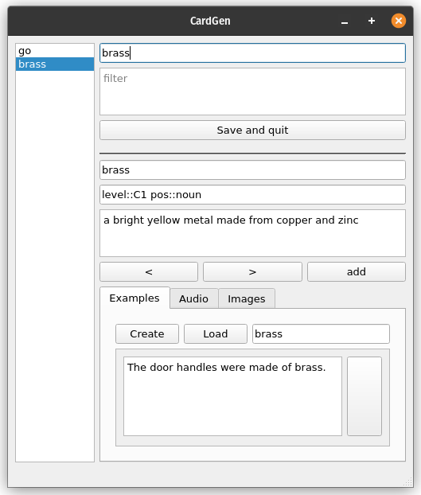

# Dict2FlashCardsQT

Dict2FlashCardQT -- это приложение, написанное на QT + локальный сервер Python
плагинов.



Цель данного проекта -- облегчение создания языковых карточек для
разных платформ, будь то Anki или Quizlet. Это удается посредством использования
ранее упомянутых плагинов: с помощью них можно как добавить поддержку нужной 
платфомы, так и подключать словари, базы данных предложений и т.д.

[Демо](https://drive.google.com/file/d/1rIS1JHNFXf3meiXtyr2JjPMXlY6ghrPa/view)

## Типы плагинов

Реализовано 5 видов плагинов:

* провайдеры определений
* провайдеры предложений
* провайдеры изображений
* провайдеры аудио
* сохранятели

## Интерфейс плагинов

### Общий

Каждый плагин должен реализовывать общую часть

```python
def load() -> None:
    """
    Загружает ресурсы, необходимые для работы.
    """
    ...

def get_config_description() -> dict:
    """
    Возвращает словарь, описывающий конфигурационную схему:
    {
        %поле%: {
            "docs": %документация к полю%,
            "type": %подсказка типа поля%
        },
        %вложенное поле%: {
            "docs": %документация к полю%,
            "children": {
                ...
            }
        }
    }
    """
    ...

def validate_config(new_config: dict) -> dict:
    """
    Выполняет валидацию поданной схемы

    Возвращает результат валидации:
    {
        %поле%: {
            "error_type": Literal["invalid_type", 
                                  "invalid_value", 
                                  "empty", 
                                  "unknown_field"],
            "description": %пояснение к ошибке%
        },
    }
    """
    ...

def get_default_config() -> dict:
    """
    возвращает конфигурационную схему по умолчанию
    """
    ...

def unload() -> None:
    """
    Освобождает ресурсы, используемые плагином
    """
    ...
```

### Интерфейс провайдера определений

```python
class SourceWithAdditionalInfo(TypedDict):
    source: str  
    info: str

class Media(TypedDict):
    local: list[SourceWithAdditionalInfo] 
    web: list[SourceWithAdditionalInfo] 

class Card(TypedDict):
    word: str  
    special: list[str]  # дополнительные факты о слове
    definition: str
    examples: list[str]
    audios: Media
    images: Media
    tags:   dict  # иерархия тэгов. просто вложенный словарь словарей строк
    other:  dict  # другая информация. Не будет показано на карточке, но может 
                  # быть использована в языке запросов

def get(word: str, config: dict) -> Generator[tuple[list[Card], str], int, None]:
    """
    Генератор, возвращающий список карточек с сообщением об ошибке.
    Приминает размер пакета на каждой итерации.
    """
    ...

def get_dict_scheme() -> dict:
    """
    Возвращает схему для самого словаря. Например, что именно словарь кладет в 
    поле "tags" и "other"
    {
        %поле%: {
            "docs": %документация%,
            "type": %подсказка типа%
        },
        %вложенное поле%: {
            "docs": %документация%,
            "children": {
                ...
            }
        }

    }

    """
    ...
```

### Интерфейс провайдера предложений

```python
def get(word: str, config: dict) -> Generator[tuple[list[str], str], int, None]:
    """
    Генератор, возвращающий список предложений с сообщением об ошибке.
    Приминает размер пакета на каждой итерации.
    """
    ...
```

### Интерфейс провайдера изображений

```python
class SourceWithAdditionalInfo(TypedDict):
    source: str  
    info: str

class Media(TypedDict):
    local: list[SourceWithAdditionalInfo] 
    web: list[SourceWithAdditionalInfo] 

def get(word: str, config: dict) -> Generator[tuple[Media, str], int, None]:
    """
    Генератор, возвращающий ссылки на изобжания / пути к ним.
    Приминает размер пакета на каждой итерации.
    """
    ...
```

### Интерфейс провайдера аудио

```python
class SourceWithAdditionalInfo(TypedDict):
    source: str  
    info: str

class Media(TypedDict):
    local: list[SourceWithAdditionalInfo] 
    web: list[SourceWithAdditionalInfo] 

def get(word: str, config: dict) -> Generator[tuple[Media, str], int, None]:
    """
    Генератор, возвращающий ссылки на аудио / пути к ним.
    Приминает размер пакета на каждой итерации.
    """
    ...
```

### Интерфейс сохранятелей

```python
def save(deck_path: str) -> str:
    """
    Принимает путь к файлу с карточками для дальнейшего его специализации под
    нужную платформу. Возвращает описание ошибки.

    Формат файла с карточками: 
    [
    {
        "word": %слово%
        "definition": %определение%,
        "examples": %список предложений%,
        "audios": {
            "local":%список путей%,
            "web":%список ссылок%
        },
        "images": {
            "local": %список путей%,
            "web": %список ссылок%
        },
        "tags": %вложенный словарь тэгов%
        "special": %список с доп. информацией - строками%,
        "other": %остальная информация%,
    },
    ...
    ]

    """
    ...

```

## Язык запросов

Язык запросов необходим для фильтрации определений. Например, чтобы отобрать
только C2 определения, или чтобы выбрать только определения где обязательно есть
примеры

Чтобы получить значение из поля карточки нужно написать

`%поле%[%вложенное поле 1%]...[%вложенное поле N%]`

Поля карточки:

```json
{
    "word": str  
    "special": list[str]  # дополнительные факты о слове
    "definition": str
    "examples": list[str]
    "audios": {
        "local": [[путь, доп. информация], ...],
        "web":   [[ссылка, доп. информация], ...]
    },
    "images": {
        "local": [[путь, доп. информация], ...],
        "web":   [[ссылка, доп. информация], ...]
    }
    "tags":  dict  # иерархия тэгов. просто вложенный словарь словарей строк
    "other": dict  # другая информация. Не будет показано на карточке, но может 
                    # быть использована в языке запросов
}
```

Язык поддерживает

логические операции:

* and  
* or
* not

арифметические операции:

* \+
* \-
* \*
* \/

Сравнение

* \=\=
* \!\=
* \>
* \>\=
* \<
* \<\=

функции

* in

  Проверка на вхождение.
  Пример:
  * `"do" in (word)` находится ли строка "do" где-либо в поле `word`
* len

  Вычисление длины последовательности.
  Пример:
  * `len(examples)` количество примеров
  * `len(word)`  длина слова

* split

  Разбивает строку на пробелы.
  Пример:
  * `len(split(word))` количество отдельных слов в поле word

* lower

  Приводит строку в нижний регистр.

* upper

  Приводит строку в верхний регистр.

